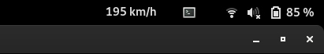

# ICE Portal for the Gnome Shell

Do you want to see how fast your current ICE is going while working on your laptop?
Today is your day!
This extension for the Gnome Shell allows you to receive the current speed of your ICE at regular intervals!
No more looking up to know how fast you are going :muscle:. 
Who knows, maybe this extension even allows for more information in the future?

## Installation

Installation is quite simple:
1. Install `curl` (I'm sorry about this dependency but I could not make requests with Soup work until now...)
1. Copy/or checkout the repository into the following directory: `~/.local/share/gnome-shell/extensions/iceportal@bartzi.de`.
1. reload the session (on X) or logout and login again (on Wayland)
1. Connect to the WiFi on your ICE
1. Open the `Extensions` Dialog and Enable the extension
1. Enjoy!

## License

The code is licensed under the GPLv3.
